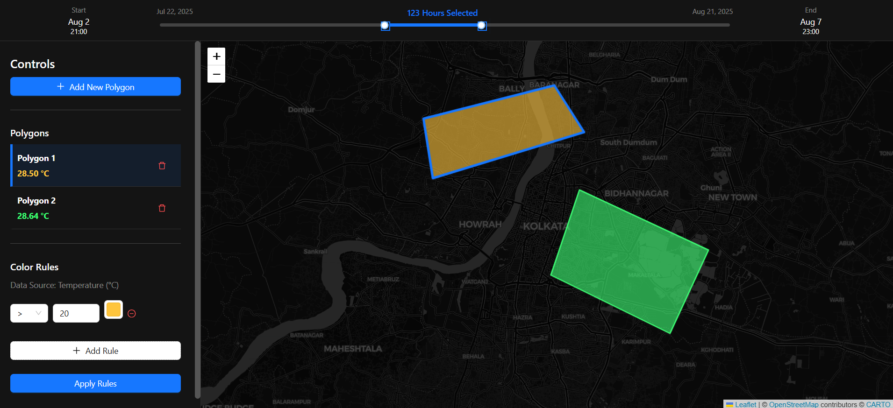

# Geo-Temporal Data Dashboard

This project is an interactive web dashboard designed to visualize dynamic, time-based geographical data. Users can define polygonal regions on an interactive map, connect them to a live weather data source, and see the regions' colors change in real-time based on user-defined rules and a draggable timeline.


## Tech Stack & Libraries Used

This project was built using a modern and robust tech stack:

-   **React:** The core UI library for building the user interface.
-   **TypeScript:** For adding static typing to JavaScript, improving code quality and maintainability.
-   **Redux Toolkit:** For predictable and centralized state management across the entire application.
-   **React-Leaflet:** A React wrapper for the Leaflet mapping library, used to render the interactive map and polygons.
--   **Ant Design:** A comprehensive UI component library used for creating a professional and consistent user interface (Slider, Buttons, Lists, Forms, etc.).
-   **Axios:** A promise-based HTTP client for making requests to the Open-Meteo API.
-   **date-fns:** A modern and lightweight library for all date and time manipulation.

## Application Screenshot



## Live Demo

**Live Link:** [**Click Me**](https://geo-temporal-dashboard-three.vercel.app/)

## Setup and Run Instructions

To run this project on your local machine, please follow these steps:

1.  **Clone the repository:**
    ```bash
    git clone https://github.com/Ranaiiest/geo-temporal-dashboard.git
    ```

2.  **Navigate to the project directory:**
    ```bash
    cd geo-temporal-dashboard
    ```

3.  **Install dependencies:**
    This command will install all the necessary libraries listed in `package.json`.
    ```bash
    npm install
    ```

4.  **Start the development server:**
    This will run the app in development mode.
    ```bash
    npm start
    ```

5.  **Open the application:**
    Open [http://localhost:3000](http://localhost:3000) to view it in your browser. The page will automatically reload if you make any edits.
